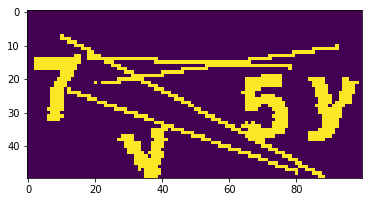
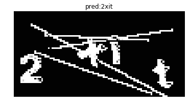

### Capsolver

> [](https://www.capsolver.com)
> 
> [Capsolver.com](https://www.capsolver.com/?utm_source=github&utm_medium=banner_github&utm_campaign=SimGAN-Captcha) is an AI-powered service that specializes in solving various types of captchas automatically. It supports captchas such as [reCAPTCHA V2](https://docs.capsolver.com/guide/captcha/ReCaptchaV2.html?utm_source=github&utm_medium=banner_github&utm_campaign=SimGAN-Captcha), [reCAPTCHA V3](https://docs.capsolver.com/guide/captcha/ReCaptchaV3.html?utm_source=github&utm_medium=banner_github&utm_campaign=SimGAN-Captcha), [hCaptcha](https://docs.capsolver.com/guide/captcha/HCaptcha.html?utm_source=github&utm_medium=banner_github&utm_campaign=SimGAN-Captcha), [FunCaptcha](https://docs.capsolver.com/guide/captcha/FunCaptcha.html?utm_source=github&utm_medium=banner_github&utm_campaign=SimGAN-Captcha), [DataDome](https://docs.capsolver.com/guide/captcha/DataDome.html?utm_source=github&utm_medium=banner_github&utm_campaign=SimGAN-Captcha), [AWS Captcha](https://docs.capsolver.com/guide/captcha/awsWaf.html?utm_source=github&utm_medium=banner_github&utm_campaign=SimGAN-Captcha), [Geetest](https://docs.capsolver.com/guide/captcha/Geetest.html?utm_source=github&utm_medium=banner_github&utm_campaign=SimGAN-Captcha), and Cloudflare [Captcha](https://docs.capsolver.com/guide/antibots/cloudflare_turnstile.html?utm_source=github&utm_medium=banner_github&utm_campaign=SimGAN-Captcha) / [Challenge 5s](https://docs.capsolver.com/guide/antibots/cloudflare_challenge.html?utm_source=github&utm_medium=banner_github&utm_campaign=SimGAN-Captcha), [Imperva / Incapsula](https://docs.capsolver.com/guide/antibots/imperva.html?utm_source=github&utm_medium=banner_github&utm_campaign=SimGAN-Captcha), among others.
> 
> For developers, Capsolver offers API integration options detailed in their [documentation](https://docs.capsolver.com/?utm_source=github&utm_medium=banner_github&utm_campaign=SimGAN-Captcha), facilitating the integration of captcha solving into applications. They also provide browser extensions for [Chrome](https://chromewebstore.google.com/detail/captcha-solver-auto-captc/pgojnojmmhpofjgdmaebadhbocahppod) and [Firefox](https://addons.mozilla.org/es/firefox/addon/capsolver-captcha-solver/), making it easy to use their service directly within a browser. Different pricing packages are available to accommodate varying needs, ensuring flexibility for users.


# SimGAN-Captcha

With simulated unsupervised learning, breaking captchas has never been easier. There is no need to label any captchas manually for convnet. By using a captcha synthesizer and a refiner trained with GAN, it's feasible to generate synthesized training pairs for classifying captchas.

## Link to paper: SimGAN by Apple 

[PDF](https://arxiv.org/pdf/1612.07828v1.pdf)
[HTML](https://machinelearning.apple.com/2017/07/07/GAN.html)


# The task

[HackMIT Puzzle #5](https://captcha.delorean.codes/u/rickyhan/).

Correctly label 10000 out of 15000 captcha or 90% per character.

## Preprocessing

### Download target captcha files

Here we download some captchas from the contest website. Each batch has 1000 captchas. We'll use 20000 so 20 batches.


```python
import requests
import threading
URL = "https://captcha.delorean.codes/u/rickyhan/challenge"
DIR = "challenges/"
NUM_CHALLENGES = 20
lock = threading.Lock()
```


```python
def download_file(url, fname):
    # NOTE the stream=True parameter
    r = requests.get(url, stream=True)
    with open(fname, 'wb') as f:
        for chunk in r.iter_content(chunk_size=1024): 
            if chunk: # filter out keep-alive new chunks
                f.write(chunk)
                #f.flush() commented by recommendation from J.F.Sebastian
    with lock:
        pass
        # print fname


ts = []
for i in range(NUM_CHALLENGES):
    fname = DIR + "challenge-{}".format(i)
    t = threading.Thread(target=download_file, args=(URL, fname))
    ts.append(t)
    t.start()
for t in ts:
    t.join()
print "Done"
```

    Done


### Decompression

Each challenge file is actually a json object containing 1000 base64 encoded jpg image file. So for each of these challenge files, we decompress each base64 strs into a jpeg and put that under a seprate folder.


```python
import json, base64, os
IMG_DIR = "./orig"
fnames = ["{}/challenge-{}".format(DIR, i) for i in range(NUM_CHALLENGES)]
if not os.path.exists(IMG_DIR):
    os.mkdir(IMG_DIR)
def save_imgs(fname):
    with open(fname) as f:
        l = json.loads(f.read())

    for image in l['images']:
        b = base64.decodestring(image['jpg_base64'])
        name = image['name']
        with open(IMG_DIR+"/{}.jpg".format(name), 'w') as f:
            f.write(b)

for fname in fnames:
    save_imgs(fname)
assert len(os.listdir(IMG_DIR)) == 1000 * NUM_CHALLENGES
```


```python
from PIL import Image
imgpath = IMG_DIR + "/"+ os.listdir(IMG_DIR)[0]
imgpath2 = IMG_DIR + "/"+ os.listdir(IMG_DIR)[3]
im = Image.open(example_image_path)
im2 = Image.open(example_image_path2)
IMG_FNAMES = [IMG_DIR + '/' + p for p in os.listdir(IMG_DIR)]
```


```python
im
```


```python
im2
```


### Convert to black and white
Instead of RGB, binarized image saves significant compute. Here we hardcode a threshold and iterate over each pixel to obtain a binary image.


```python
def gray(img_path):
    # convert to grayscale, then binarize
    img = Image.open(img_path).convert("L")
    img = img.point(lambda x: 255 if x > 200 or x == 0 else x) # value found through T&E
    img = img.point(lambda x: 0 if x < 255 else 255, "1")
    img.save(img_path)

for img_path in IMG_FNAMES:
    gray(img_path)
```


```python
im = Image.open(example_image_path)
im
```


### Find mask

As you may have noticed, all the captchas share the same horizontal lines. Since this is a contest, it was a function of participant's username. In the real world, these noises can be filtered out using morphological transformation with OpenCV.

We will extract and save the lines(noise) for later use. Here we average all 20000 captchas and set a threshold as above. Another method is using a bit mask (&=) to iteratively filter out surrounding black pixels i.e.

```
mask = np.ones((height, width))
for im in ims:
    mask &= im
```

The effectiveness of bit mask depends on how clean the binarized data is. With the averaging method, some error is allowed.


```python
import numpy as np
WIDTH, HEIGHT = im.size
MASK_DIR = "avg.png"
```


```python
def generateMask():
    N=1000*NUM_CHALLENGES
    arr=np.zeros((HEIGHT, WIDTH),np.float)
    for fname in IMG_FNAMES:
        imarr=np.array(Image.open(fname),dtype=np.float)
        arr=arr+imarr/N
    arr=np.array(np.round(arr),dtype=np.uint8)
    out=Image.fromarray(arr,mode="L")
    out.save(MASK_DIR)

generateMask()
```


```python
im = Image.open(MASK_DIR) # ok this can be done with binary mask: &=
im
```


```python
im = Image.open(MASK_DIR)
im = im.point(lambda x:255 if x > 230 else x)
im = im.point(lambda x:0 if x<255 else 255, "1")
im.save(MASK_DIR)
```


```python
im
```


# Generator for real captchas

Using a Keras built in generator function `flow_from_directory` to automatically import and preprocess real captchas from a folder.


```python
from keras import models
from keras import layers
from keras import optimizers
from keras import applications
from keras.preprocessing import image
import tensorflow as tf
```


```python
# Real data generator

datagen = image.ImageDataGenerator(
    preprocessing_function=applications.xception.preprocess_input
)

flow_from_directory_params = {'target_size': (HEIGHT, WIDTH),
                              'color_mode': 'grayscale',
                              'class_mode': None,
                              'batch_size': BATCH_SIZE}

real_generator = datagen.flow_from_directory(
        directory=".",
        **flow_from_directory_params
)
```

# (Dumb) Generator

Now that we have processed all the real captchas, we need to define a generator that outputs (captcha, label) pairs where the captchas should look almost like the real ones.

We filter out the outliers that contain overlapping characters.


```python
# Synthetic captcha generator
from PIL import ImageFont, ImageDraw
from random import choice, random
from string import ascii_lowercase, digits
alphanumeric = ascii_lowercase + digits


def fuzzy_loc(locs):
    acc = []
    for i,loc in enumerate(locs[:-1]):
        if locs[i+1] - loc < 8:
            continue
        else:
            acc.append(loc)
    return acc

def seg(img):
    arr = np.array(img, dtype=np.float)
    arr = arr.transpose()
    # arr = np.mean(arr, axis=2)
    arr = np.sum(arr, axis=1)
    locs = np.where(arr < arr.min() + 2)[0].tolist()
    locs = fuzzy_loc(locs)
    return locs

def is_well_formed(img_path):
    original_img = Image.open(img_path)
    img = original_img.convert('1')
    return len(seg(img)) == 4

noiseimg = np.array(Image.open("avg.png").convert("1"))
# noiseimg = np.bitwise_not(noiseimg)
fnt = ImageFont.truetype('./arial-extra.otf', 26)
def gen_one():
    og = Image.new("1", (100,50))
    text = ''.join([choice(alphanumeric) for _ in range(4)])
    draw = ImageDraw.Draw(og)
    for i, t in enumerate(text):
        txt=Image.new('L', (40,40))
        d = ImageDraw.Draw(txt)
        d.text( (0, 0), t,  font=fnt, fill=255)
        if random() > 0.5:
            w=txt.rotate(-20*(random()-1),  expand=1)
            og.paste( w, (i*20 + int(25*random()), int(25+30*(random()-1))),  w)
        else:
            w=txt.rotate(20*(random()-1),  expand=1)
            og.paste( w, (i*20 + int(25*random()), int(20*random())),  w)
    segments = seg(og)
    if len(segments) != 4:
        return gen_one()
    ogarr = np.array(og)
    ogarr = np.bitwise_or(noiseimg, ogarr)
    ogarr = np.expand_dims(ogarr, axis=2).astype(float)
    ogarr = np.random.random(size=(50,100,1)) * ogarr
    ogarr = (ogarr > 0.0).astype(float) # add noise
    return ogarr, text

def synth_generator():
    arrs = []
    while True:
        for _ in range(BATCH_SIZE):
            arrs.append(gen_one()[0])
        yield np.array(arrs)
        arrs = []
```


```python
def get_image_batch(generator):
    """keras generators may generate an incomplete batch for the last batch"""
    img_batch = generator.next()
    if len(img_batch) != BATCH_SIZE:
        img_batch = generator.next()

    assert len(img_batch) == BATCH_SIZE

    return img_batch
```


```python
import matplotlib.pyplot as plt
imarr = get_image_batch(real_generator)[0, :, :, 0]
plt.imshow(imarr)
```


    <matplotlib.image.AxesImage at 0x7f160fda74d0>


```python
imarr = get_image_batch(synth_generator())[0, :, :, 0]
print imarr.shape
plt.imshow(imarr)
```

    (50, 100)


    <matplotlib.image.AxesImage at 0x7f160fdd4390>





# What happened next?

Plug all the data in an MNIST-like classifier and call it a day. Unfortunately, it's not that simple.

I actually spent a long time fine-tuning the network but accuracy plateued around 55% sampled. The passing requirement is 10000 out of 15000 submitted or 90% accuracy or 66% per char. I was facing a dilemma: tune the model even further or manually label x amount of data: 
```
0.55 * (15000-x) + x = 10000
                   x = 3888
```

Obviously I am not going to label 4000 captchas and break my neck in the process.

Meanwhile, there happened a burnt out guy who decided to label all 10000 captchas. This dilligent dude was 2000 in. I asked if he is willing to collaborate on a solution. It's almost like he didn't want to label captchas anymore. He agreed immediately.

Using the same model, accuracy immediately shot up to 95% and we both qualified for HackMIT.

/aside

After the contest, I perfected the model and got 95% without labelling a single image. Here is the model for SimGAN:


# Model Definition

There are three components to the network:

### Refiner

The refiner network, Rθ, is a residual network (ResNet). It modifies the synthetic image on a pixel level, rather than holistically modifying the image content, preserving the global structure and annotations.

### Discriminator

The discriminator network Dφ, is a simple ConvNet that contains 5 conv layers and 2 max-pooling layers. It's abinary classifier that outputs whether a captcha is synthesized or real.

### Combined

Pipe the refined image into discriminator.


```python
def refiner_network(input_image_tensor):
    """
    :param input_image_tensor: Input tensor that corresponds to a synthetic image.
    :return: Output tensor that corresponds to a refined synthetic image.
    """
    def resnet_block(input_features, nb_features=64, nb_kernel_rows=3, nb_kernel_cols=3):
        """
        A ResNet block with two `nb_kernel_rows` x `nb_kernel_cols` convolutional layers,
        each with `nb_features` feature maps.
        See Figure 6 in https://arxiv.org/pdf/1612.07828v1.pdf.
        :param input_features: Input tensor to ResNet block.
        :return: Output tensor from ResNet block.
        """
        y = layers.Convolution2D(nb_features, nb_kernel_rows, nb_kernel_cols, border_mode='same')(input_features)
        y = layers.Activation('relu')(y)
        y = layers.Convolution2D(nb_features, nb_kernel_rows, nb_kernel_cols, border_mode='same')(y)

        y = layers.merge([input_features, y], mode='sum')
        return layers.Activation('relu')(y)

    # an input image of size w × h is convolved with 3 × 3 filters that output 64 feature maps
    x = layers.Convolution2D(64, 3, 3, border_mode='same', activation='relu')(input_image_tensor)

    # the output is passed through 4 ResNet blocks
    for _ in range(4):
        x = resnet_block(x)

    # the output of the last ResNet block is passed to a 1 × 1 convolutional layer producing 1 feature map
    # corresponding to the refined synthetic image
    return layers.Convolution2D(1, 1, 1, border_mode='same', activation='tanh')(x)

def discriminator_network(input_image_tensor):
    """
    :param input_image_tensor: Input tensor corresponding to an image, either real or refined.
    :return: Output tensor that corresponds to the probability of whether an image is real or refined.
    """
    x = layers.Convolution2D(96, 3, 3, border_mode='same', subsample=(2, 2), activation='relu')(input_image_tensor)
    x = layers.Convolution2D(64, 3, 3, border_mode='same', subsample=(2, 2), activation='relu')(x)
    x = layers.MaxPooling2D(pool_size=(3, 3), border_mode='same', strides=(1, 1))(x)
    x = layers.Convolution2D(32, 3, 3, border_mode='same', subsample=(1, 1), activation='relu')(x)
    x = layers.Convolution2D(32, 1, 1, border_mode='same', subsample=(1, 1), activation='relu')(x)
    x = layers.Convolution2D(2, 1, 1, border_mode='same', subsample=(1, 1), activation='relu')(x)

    # here one feature map corresponds to `is_real` and the other to `is_refined`,
    # and the custom loss function is then `tf.nn.sparse_softmax_cross_entropy_with_logits`
    return layers.Reshape((-1, 2))(x)

# Refiner
synthetic_image_tensor = layers.Input(shape=(HEIGHT, WIDTH, 1))
refined_image_tensor = refiner_network(synthetic_image_tensor)
refiner_model = models.Model(input=synthetic_image_tensor, output=refined_image_tensor, name='refiner')

# Discriminator
refined_or_real_image_tensor = layers.Input(shape=(HEIGHT, WIDTH, 1))
discriminator_output = discriminator_network(refined_or_real_image_tensor)
discriminator_model = models.Model(input=refined_or_real_image_tensor, output=discriminator_output,
                                   name='discriminator')

# Combined
refiner_model_output = refiner_model(synthetic_image_tensor)
combined_output = discriminator_model(refiner_model_output)
combined_model = models.Model(input=synthetic_image_tensor, output=[refiner_model_output, combined_output],
                              name='combined')

def self_regularization_loss(y_true, y_pred):
    delta = 0.0001  # FIXME: need to figure out an appropriate value for this
    return tf.multiply(delta, tf.reduce_sum(tf.abs(y_pred - y_true)))

# define custom local adversarial loss (softmax for each image section) for the discriminator
# the adversarial loss function is the sum of the cross-entropy losses over the local patches
def local_adversarial_loss(y_true, y_pred):
    # y_true and y_pred have shape (batch_size, # of local patches, 2), but really we just want to average over
    # the local patches and batch size so we can reshape to (batch_size * # of local patches, 2)
    y_true = tf.reshape(y_true, (-1, 2))
    y_pred = tf.reshape(y_pred, (-1, 2))
    loss = tf.nn.softmax_cross_entropy_with_logits(labels=y_true, logits=y_pred)

    return tf.reduce_mean(loss)


# compile models
BATCH_SIZE = 512
sgd = optimizers.RMSprop()

refiner_model.compile(optimizer=sgd, loss=self_regularization_loss)
discriminator_model.compile(optimizer=sgd, loss=local_adversarial_loss)
discriminator_model.trainable = False
combined_model.compile(optimizer=sgd, loss=[self_regularization_loss, local_adversarial_loss])
```

# Pre-training

It is not necessary to pre-train GANs but it seems pretraining makes GANs converge faster. Here we pre-train both models. For the refiner, we train by supplying the identity. For the discriminator, we train with the correct real, synth labeled pairs.


```python
# the target labels for the cross-entropy loss layer are 0 for every yj (real) and 1 for every xi (refined)

y_real = np.array([[[1.0, 0.0]] * discriminator_model.output_shape[1]] * BATCH_SIZE)
y_refined = np.array([[[0.0, 1.0]] * discriminator_model.output_shape[1]] * BATCH_SIZE)
assert y_real.shape == (BATCH_SIZE, discriminator_model.output_shape[1], 2)
```


```python
LOG_INTERVAL = 10
MODEL_DIR = "./model/"
print('pre-training the refiner network...')
gen_loss = np.zeros(shape=len(refiner_model.metrics_names))

for i in range(100):
    synthetic_image_batch = get_image_batch(synth_generator())
    gen_loss = np.add(refiner_model.train_on_batch(synthetic_image_batch, synthetic_image_batch), gen_loss)

    # log every `log_interval` steps
    if not i % LOG_INTERVAL:
        print('Refiner model self regularization loss: {}.'.format(gen_loss / LOG_INTERVAL))
        gen_loss = np.zeros(shape=len(refiner_model.metrics_names))

refiner_model.save(os.path.join(MODEL_DIR, 'refiner_model_pre_trained.h5'))

```

    pre-training the refiner network...
    Saving batch of refined images during pre-training at step: 0.
    Refiner model self regularization loss: [ 0.05277019].
    Saving batch of refined images during pre-training at step: 10.
    Refiner model self regularization loss: [ 4.2269813].
    Saving batch of refined images during pre-training at step: 20.
    Refiner model self regularization loss: [ 0.76108101].
    Saving batch of refined images during pre-training at step: 30.
    Refiner model self regularization loss: [ 0.28633648].
    Saving batch of refined images during pre-training at step: 40.
    Refiner model self regularization loss: [ 0.19448772].
    Saving batch of refined images during pre-training at step: 50.
    Refiner model self regularization loss: [ 0.16131182].
    Saving batch of refined images during pre-training at step: 60.
    Refiner model self regularization loss: [ 0.11931724].
    Saving batch of refined images during pre-training at step: 70.
    Refiner model self regularization loss: [ 0.11075923].
    Saving batch of refined images during pre-training at step: 80.
    Refiner model self regularization loss: [ 0.10888441].
    Saving batch of refined images during pre-training at step: 90.
    Refiner model self regularization loss: [ 0.10765313].


```python
from tqdm import tqdm
print('pre-training the discriminator network...')
disc_loss = np.zeros(shape=len(discriminator_model.metrics_names))

for _ in tqdm(range(100)):
    real_image_batch = get_image_batch(real_generator)
    disc_loss = np.add(discriminator_model.train_on_batch(real_image_batch, y_real), disc_loss)

    synthetic_image_batch = get_image_batch(synth_generator())
    refined_image_batch = refiner_model.predict_on_batch(synthetic_image_batch)
    disc_loss = np.add(discriminator_model.train_on_batch(refined_image_batch, y_refined), disc_loss)

discriminator_model.save(os.path.join(MODEL_DIR, 'discriminator_model_pre_trained.h5'))

# hard-coded for now
print('Discriminator model loss: {}.'.format(disc_loss / (100 * 2)))
```

    pre-training the discriminator network...
    Discriminator model loss: [ 0.04783788].


# Training

This is the most important training step in which we refine a synthesized captcha, then pass it through the discriminator and backprop gradients.


```python
from image_history_buffer import ImageHistoryBuffer


k_d = 1  # number of discriminator updates per step
k_g = 2  # number of generative network updates per step
nb_steps = 1000

# TODO: what is an appropriate size for the image history buffer?
image_history_buffer = ImageHistoryBuffer((0, HEIGHT, WIDTH, 1), BATCH_SIZE * 100, BATCH_SIZE)

combined_loss = np.zeros(shape=len(combined_model.metrics_names))
disc_loss_real = np.zeros(shape=len(discriminator_model.metrics_names))
disc_loss_refined = np.zeros(shape=len(discriminator_model.metrics_names))

# see Algorithm 1 in https://arxiv.org/pdf/1612.07828v1.pdf
for i in range(nb_steps):
    print('Step: {} of {}.'.format(i, nb_steps))

    # train the refiner
    for _ in range(k_g * 2):
        # sample a mini-batch of synthetic images
        synthetic_image_batch = get_image_batch(synth_generator())

        # update θ by taking an SGD step on mini-batch loss LR(θ)
        combined_loss = np.add(combined_model.train_on_batch(synthetic_image_batch,
                                                             [synthetic_image_batch, y_real]), combined_loss)

    for _ in range(k_d):
        # sample a mini-batch of synthetic and real images
        synthetic_image_batch = get_image_batch(synth_generator())
        real_image_batch = get_image_batch(real_generator)

        # refine the synthetic images w/ the current refiner
        refined_image_batch = refiner_model.predict_on_batch(synthetic_image_batch)

        # use a history of refined images
        half_batch_from_image_history = image_history_buffer.get_from_image_history_buffer()
        image_history_buffer.add_to_image_history_buffer(refined_image_batch)

        if len(half_batch_from_image_history):
            refined_image_batch[:batch_size // 2] = half_batch_from_image_history

        # update φ by taking an SGD step on mini-batch loss LD(φ)
        disc_loss_real = np.add(discriminator_model.train_on_batch(real_image_batch, y_real), disc_loss_real)
        disc_loss_refined = np.add(discriminator_model.train_on_batch(refined_image_batch, y_refined),
                                   disc_loss_refined)

    if not i % LOG_INTERVAL:
        # log loss summary
        print('Refiner model loss: {}.'.format(combined_loss / (LOG_INTERVAL * k_g * 2)))
        print('Discriminator model loss real: {}.'.format(disc_loss_real / (LOG_INTERVAL * k_d * 2)))
        print('Discriminator model loss refined: {}.'.format(disc_loss_refined / (LOG_INTERVAL * k_d * 2)))

        combined_loss = np.zeros(shape=len(combined_model.metrics_names))
        disc_loss_real = np.zeros(shape=len(discriminator_model.metrics_names))
        disc_loss_refined = np.zeros(shape=len(discriminator_model.metrics_names))

        # save model checkpoints
        model_checkpoint_base_name = os.path.join(MODEL_DIR, '{}_model_step_{}.h5')
        refiner_model.save(model_checkpoint_base_name.format('refiner', i))
        discriminator_model.save(model_checkpoint_base_name.format('discriminator', i))

```

    Step: 0 of 1000.
    Saving batch of refined images at adversarial step: 0.
    Refiner model loss: [ 2.46834831  0.01272553  2.45562277].
    Discriminator model loss real: [  2.27849432e-07].
    Discriminator model loss refined: [  1.63936726e-05].
    Step: 1 of 1000.
    Step: 2 of 1000.
    Step: 3 of 1000.
    Step: 4 of 1000.
    Step: 5 of 1000.
    Step: 6 of 1000.
    Step: 7 of 1000.
    Step: 8 of 1000.
    Step: 9 of 1000.
    Step: 10 of 1000.
    Saving batch of refined images at adversarial step: 10.
    Refiner model loss: [ 27.00968537   0.11238954  26.8972959 ].
    Discriminator model loss real: [  1.26835085e-10].
    Discriminator model loss refined: [  4.44882481e-08].
    Step: 11 of 1000.
    Step: 12 of 1000.
    Step: 13 of 1000.
    Step: 14 of 1000.
    Step: 15 of 1000.
    Step: 16 of 1000.
    Step: 17 of 1000.
    Step: 18 of 1000.
    Step: 19 of 1000.
    Step: 20 of 1000.
    Saving batch of refined images at adversarial step: 20.
    Refiner model loss: [ 26.89902883   0.10987803  26.78915081].
    Discriminator model loss real: [  1.48619811e-07].
    Discriminator model loss refined: [  4.60907181e-08].
    Step: 21 of 1000.
    Step: 22 of 1000.
    Step: 23 of 1000.
    Step: 24 of 1000.
    Step: 25 of 1000.
    Step: 26 of 1000.
    Step: 27 of 1000.
    Step: 28 of 1000.
    Step: 29 of 1000.
    Step: 30 of 1000.
    Saving batch of refined images at adversarial step: 30.
    Refiner model loss: [ 25.93090506   0.10890296  25.82200208].
    Discriminator model loss real: [  3.96611703e-09].
    Discriminator model loss refined: [  5.07067440e-08].
    Step: 31 of 1000.
    Step: 32 of 1000.
    Step: 33 of 1000.
    Step: 34 of 1000.
    Step: 35 of 1000.
    Step: 36 of 1000.
    Step: 37 of 1000.
    Step: 38 of 1000.
    Step: 39 of 1000.
    Step: 40 of 1000.
    Saving batch of refined images at adversarial step: 40.
    Refiner model loss: [ 28.67232819   2.33041485  26.34191332].


# Results of SimGAN:

As you can see below, we no longer have the cookie-cutter fonts. There are quite a few artifacts that did not exist before refinement. The edges are blurred and noisy - which is *impossible* to simulate heuristically. And it is exactly these tiny things that renders MNIST-like convnet useless.

Now the refined results are basically the original captchas.


```python
synthetic_image_batch = get_image_batch(synth_generator())
arr = refiner_model.predict_on_batch(synthetic_image_batch)
```


```python
plt.imshow(arr[200, :, :, 0])
```


    <matplotlib.image.AxesImage at 0x7f161417fa90>


```python
plt.imshow(get_image_batch(real_generator)[2,:,:,0])
```


    <matplotlib.image.AxesImage at 0x7f1614381690>


# MNIST for Captcha

Now we finish the puzzle by building an MNIST like convnet to predict captcha labels.


```python
n_class = len(alphanumeric)

def mnist_raw_generator(batch_size=128):
    X = np.zeros((batch_size, HEIGHT, WIDTH, 1), dtype=np.uint8)
    y = [np.zeros((batch_size, n_class), dtype=np.uint8) for _ in range(4)] # 4 chars
    while True:
        for i in range(batch_size):
            im, random_str = gen_one()
            X[i] = im
            for j, ch in enumerate(random_str):
                y[j][i, :] = 0
                y[j][i, alphanumeric.find(ch)] = 1
        yield np.array(X), y

def mnist_generator(batch_size=128):
    X = np.zeros((batch_size, HEIGHT, WIDTH, 1), dtype=np.uint8)
    y = [np.zeros((batch_size, n_class), dtype=np.uint8) for _ in range(4)] # 4 chars
    while True:
        for i in range(batch_size):
            im, random_str = gen_one()
            X[i] = im
            for j, ch in enumerate(random_str):
                y[j][i, :] = 0
                y[j][i, alphanumeric.find(ch)] = 1
        yield refiner_model.predict(np.array(X)), y

mg = mnist_generator().next()

# plt.imshow(mg[0][0,:,:,0]) # sanity check
```


```python
from keras.layers import *

input_tensor = Input((HEIGHT, WIDTH, 1))
x = input_tensor
x = Conv2D(32, kernel_size=(3, 3),
                 activation='relu')(x)
for _ in range(4):
    x = Conv2D(128, (3, 3), activation='relu')(x)
    x = MaxPooling2D(pool_size=(2, 2))(x)
x = Dropout(0.25)(x)
x = Flatten()(x)
x = Dense(128, activation='relu')(x)
x = Dropout(0.5)(x)
x = [Dense(n_class, activation='softmax', name='c%d'%(i+1))(x) for i in range(4)]

model = models.Model(inputs=input_tensor, outputs=x)
model.compile(loss='categorical_crossentropy',
              optimizer='rmsprop',
              metrics=['accuracy'])
```


```python
from keras.callbacks import History
history = History()
model.fit_generator(mnist_generator(), steps_per_epoch=1000, epochs=20, callbacks=[history])
```

    Epoch 1/20
     341/1000 [=========>....................] - ETA: 376s - loss: 2.7648 - c1_loss: 0.6493 - c2_loss: 0.6757 - c3_loss: 0.6681 - c4_loss: 0.7717 - c1_acc: 0.8199 - c2_acc: 0.8185 - c3_acc: 0.8197 - c4_acc: 0.7820


Obviously you will need to keep training as the per-character accuracy is only 80%

# Let's test the trained model

## Synthetic


```python
def decode(y):
    y = np.argmax(np.array(y), axis=2)[:,0]
    return ''.join([alphanumeric[x] for x in y])

X, y = next(mnist_generator(1))
plt.title('real: %s\npred:%s'%(decode(y), decode(y_pred)))
plt.imshow(X[0, :, :, 0], cmap='gray')
plt.axis('off')
```


    (-0.5, 99.5, 49.5, -0.5)


## Real


```python

X = next(real_generator)
X = refiner_model.predict(X)
y_pred = model.predict(X)
plt.title('pred:%s'%(decode(y_pred)))
plt.imshow(X[0,:,:,0], cmap='gray')
plt.axis('off')
```


    (-0.5, 99.5, 49.5, -0.5)





```python

```
